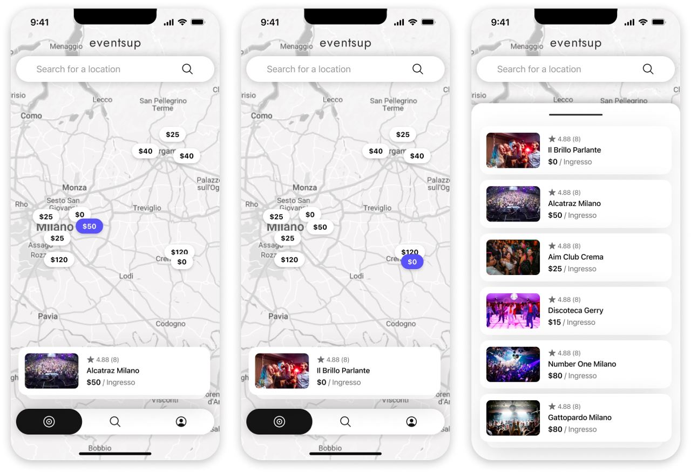

#  API


For more information, please visit our [Website](https://evup.it)

**Problem Description:** Finding detailed information about local events, such as themed parties, nightclub events, or open venues, can be challenging and frustrating. Online information is often scattered, incomplete, outdated, or unclear, leading to disappointing experiences and wasted time.

**Solution Description:** Our platform offers an innovative solution to this problem. With our free, non-profit software in the beta phase, we aim to provide a centralized hub for all local event information. Venues such as bars, nightclubs, and event organizers can freely utilize the features of our platform until it is released as an official version.

**Value Description (How It's Different from the Rest):** We differentiate ourselves from other platforms by providing updated and detailed information about local events quickly and reliably. Our platform is designed to meet the needs of various people, offering a comprehensive service that goes beyond a simple list of events.

**Note:** Venues such as bars, nightclubs, events, etc. can use the features for free until the app is released as an official version.


## Important Note:
Please **DO NOT** modify the `env.development` file under any circumstances. Instead, create a new file named `env.development.local` for local testing purposes. Make sure to exclude this file using `.gitignore` to prevent it from being committed to version control.

## Live Preview and Interactive API Testing with Swagger
You can access the live preview and interactively test the APIs using Swagger at [http://localhost:8000/swagger/](http://localhost:8000/swagger/).

Please note that the default server port is 8000.

## Getting Started
To set up the development MongoDB and Minio service using Docker, navigate to the root folder and run the following command:

```
docker-compose up -d
```

Next, install all dependencies by running:

```
npm i
```
or
```
yarn
```

To start the server, use:

```
npm run dev
```
or
```
yarn dev
```

## Configuration Files
- **npmrc**: Configured for npm package management.
- **eslintrc**: ESLint configuration for code linting.
- **prettierrc**: Prettier configuration for code formatting.

## Generating Secret Token
To generate a secret token, use the following command:

```
node -e "console.log(require('crypto').randomBytes(32).toString('hex'))"
```

## Supported Features
- [x] MongoDB: A powerful NoSQL database.
- [x] Express: Fast, unopinionated, minimalist web framework for Node.js.
- [x] Swagger: API documentation and interactive UI.
- [x] Jest: Delightful JavaScript testing.
- [x] Multer: Middleware for handling `multipart/form-data`.
- [x] Stripe: Payment processing API for online transactions.
- [x] Minio: High-performance object storage server compatible with Amazon S3 API.

## Testing
To run Jest tests for the API, execute:

```
yarn test
```
or
```
npm run test
```


## Live Development
For live development mode with nodemon auto-reload, use:

```
yarn dev
```
or
```
npm run dev
```


## Build
To build the JavaScript version for production, run:

```
yarn build
```
or
```
npm run build
```


## Start
To test the built version before deploying to a production environment, use:

```
yarn start
```
or
```
npm run start
```